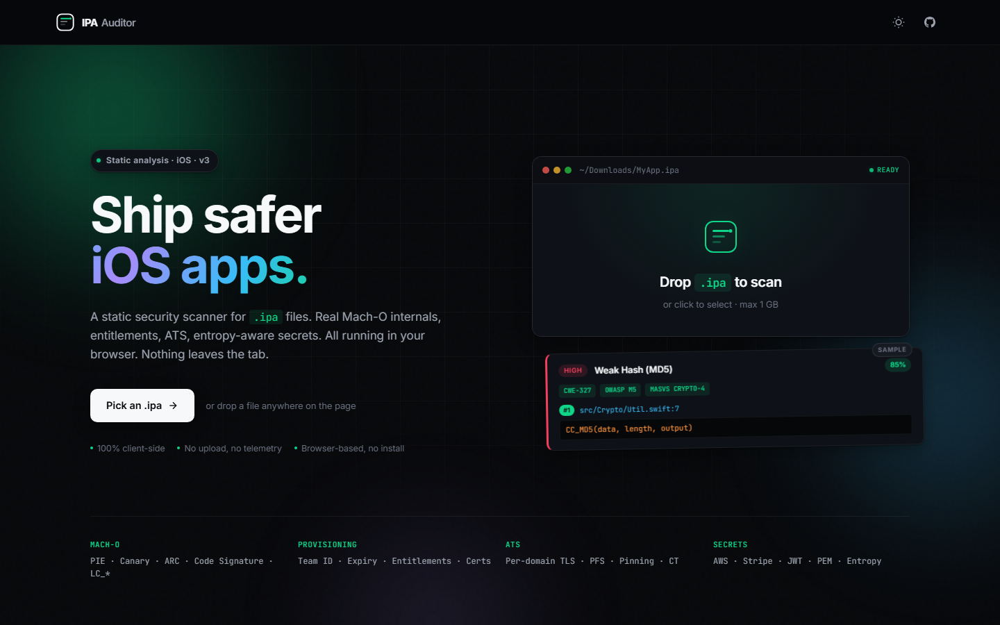
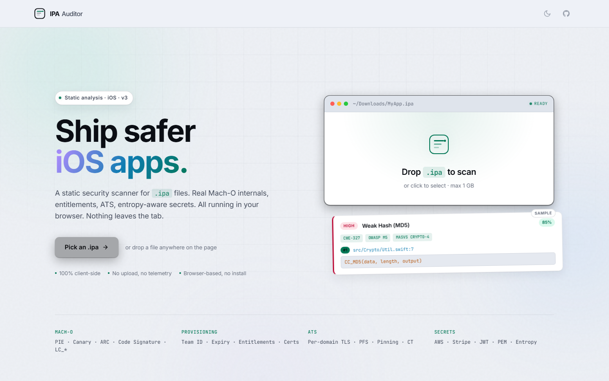

# IPA Auditor

iOS static security analysis that runs entirely in your browser. Drop an `.ipa`, get a report.

Live: **[ipaauditor.com](https://ipaauditor.com)**



## What it does

Parses the bundle, the Mach-O executable, the embedded provisioning profile and the Info.plist. Then it runs a set of pattern + entropy checks across every text file in the bundle and against the strings extracted from the binary. Nothing leaves the tab.

- Mach-O parser. Reads `LC_*` load commands, `MH_PIE` flag, `LC_ENCRYPTION_INFO_64`, `LC_CODE_SIGNATURE`, symbol table. Checksec is derived from real flags, not string matches.
- Provisioning profile. Pulls the XML plist out of the CMS/PKCS#7 wrapper, parses developer certs (subject CN, issuer, validity, serial), figures out distribution kind (App Store / Enterprise / Ad-Hoc / Development).
- Entitlements tab with risk flags on `get-task-allow`, sandbox bypasses, network extension, VPN.
- ATS deep parser. Per-domain table for HTTP, min TLS, PFS, Certificate Transparency, pinning.
- Secret detection. 22 vendor regexes (AWS, Stripe, GitHub, Slack, SendGrid, JWT, PEM, etc) gated by Shannon entropy so you don't drown in false positives. Each finding carries a confidence percentage.
- 60+ rule-based checks aligned to OWASP MASVS.
- Heavy work runs in a Web Worker with per-file progress. Falls back to main-thread on `file://`.
- Export: PDF, JSON, CSV, SARIF 2.1.

## Light mode



## Run it

The whole thing is static HTML + JS. Three ways to use it:

```bash
# 1. Just open the file
open index.html       # macOS
start index.html      # Windows
xdg-open index.html   # Linux

# 2. Serve locally (enables the Web Worker)
python3 -m http.server 8000
# then visit http://localhost:8000

# 3. Drop it on GitHub Pages / Netlify / Cloudflare Pages
# It's a static site. No build step.
```

On `file://` the Web Worker can't always spawn, so the analyzer runs on the main thread instead. Slower on big IPAs but works.

## Keyboard

| Key | Action |
|---|---|
| `/` | Focus the findings search |
| `Alt+1..6` | Switch tabs |
| `←` / `→` | Navigate tabs (when focused) |
| `Esc` | Collapse expanded findings |

## How it's organized

```
ipaauditor/
├─ index.html              shell + DOM
├─ 404.html
├─ icons/                  SVG icons
├─ lib/                    JSZip, plist.js, jsPDF (vendored, minified)
└─ src/
   ├─ styles.css
   ├─ main.js              UI + Web Worker coordinator
   ├─ analyzer.worker.js   background analyzer
   └─ core/
      ├─ macho.js          Mach-O parser
      ├─ provisioning.js   embedded.mobileprovision (CMS extractor)
      ├─ plist.js          binary + XML plist
      ├─ ats.js            per-domain ATS verdict
      ├─ entropy.js        Shannon entropy + secret detectors
      ├─ rules.js          rule registry + tracker registry
      ├─ analyzer.js       orchestrator
      ├─ export.js         JSON / CSV / SARIF
      └─ pdf.js            PDF report
```

Core modules don't depend on the DOM. They run identically in the worker and on the main thread.

## Privacy

The file you drop is read into memory in the tab and never leaves it. No telemetry, no cookies. The only thing saved is your theme preference in `localStorage`.

## What it is not

This is a static scanner. Pattern matching plus header parsing. It will miss things a dynamic analysis would catch, and it will produce false positives. Treat the output as a first pass that you triage manually.

## License

[CC BY-NC-ND 4.0](LICENSE)

## Author

[Sandeep Wawdane](https://github.com/thecybersandeep) · [LinkedIn](https://www.linkedin.com/in/sandeepwawdane/)

## Sister tools

- [APK Auditor](https://apkauditor.com) - drag-drop Android APK static analyzer
- [ADB Auditor](https://adbauditor.com) - live Android audit over WebUSB and ADB
